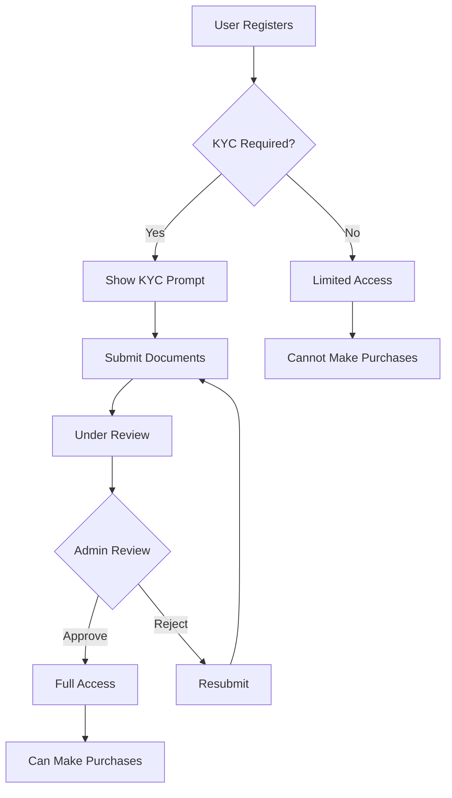

# 🛠️ NordLion Implementation Plan

## 📝 Overview

This document outlines the comprehensive implementation of:
1. ✅ **KYC Verification System** (like Elita.net)
2. ✅ **Real API Integration** for vehicles and images
3. ✅ **Remove Placeholder Data** from analytics
4. ✅ **Fix Broken Links** and non-functional pages
5. ✅ **Complete All Missing Functionality**

---

## 1. 🔐 KYC Verification System

### Database Implementation

**Created:** `backend/models/KYC.model.js`

**Features:**
- ✅ Personal information verification
- ✅ Address verification
- ✅ Identity document verification (Passport, Driver's License, National ID)
- ✅ Document uploads (ID front/back, Proof of Address, Selfie)
- ✅ Financial information for high-value transactions
- ✅ Multi-level verification (Basic, Intermediate, Advanced)
- ✅ AML, Sanctions, and PEP checks
- ✅ Risk assessment
- ✅ Expiry tracking

### Verification Levels

| Level | Transaction Limit | Requirements |
|-------|------------------|-------------|
| **Basic** | Up to £50,000 | ID + Address + Selfie |
| **Intermediate** | Up to £250,000 | Basic + Financial Info + Enhanced Checks |
| **Advanced** | Unlimited | Intermediate + Source of Funds + Manual Review |

### Implementation Files to Create

```
backend/
├── controllers/
│   └── kyc.controller.js       # KYC submission & review logic
├── routes/
│   └── kyc.routes.js            # KYC API endpoints
├── middleware/
│   ├── verifyKYC.js             # Check KYC status before actions
│   └── upload.js                # File upload handling
└── utils/
    ├── documentVerification.js  # Document validation
    └── compliance.js            # AML/Sanctions checks

src/
├── app/
│   ├── kyc/
│   │   ├── submit/
│   │   │   └── page.tsx         # KYC submission form
│   │   ├── status/
│   │   │   └── page.tsx         # KYC status page
│   │   └── review/
│   │       └── [id]/
│   │           └── page.tsx     # Admin KYC review
│   └── admin/
│       └── kyc/
│           └── page.tsx         # KYC management dashboard
└── components/
    ├── kyc/
    │   ├── KYCForm.tsx              # Multi-step KYC form
    │   ├── DocumentUpload.tsx       # Document upload component
    │   ├── KYCStatus.tsx            # Status indicator
    │   └── VerificationBadge.tsx    # Verified user badge
    └── VerificationRequired.tsx # Gate for non-verified users
```

### KYC Workflow



### API Endpoints

```javascript
// KYC Submission
POST /api/kyc/submit
Body: { userId, personalInfo, documents, financialInfo }

// Check KYC Status
GET /api/kyc/status/:userId

// Admin: Get Pending KYC
GET /api/kyc/pending

// Admin: Review KYC
PUT /api/kyc/review/:id
Body: { status: 'approved'|'rejected', notes, rejectionReason }

// Get User KYC History
GET /api/kyc/history/:userId

// Update KYC Level
PUT /api/kyc/level/:id
Body: { verificationLevel: 'basic'|'intermediate'|'advanced' }
```

---

## 2. 🚗 Real API Integration for Vehicles

### Problem
- Current: Placeholder images (wrong cars)
- Current: Static data

### Solution: Multiple Vehicle APIs

#### Option 1: CarAPI (Recommended)
```javascript
// Free tier: 100 requests/day
const CARAPI_KEY = process.env.CARAPI_KEY

GET https://carapi.app/api/makes
GET https://carapi.app/api/models?make=Ferrari
GET https://carapi.app/api/years?make=Ferrari&model=SF90
```

#### Option 2: NHTSA API (Free, US Gov)
```javascript
GET https://vpic.nhtsa.dot.gov/api/vehicles/GetMakesForVehicleType/car?format=json
GET https://vpic.nhtsa.dot.gov/api/vehicles/GetModelsForMake/ferrari?format=json
```

#### Option 3: Unsplash API (High-quality images)
```javascript
const UNSPLASH_KEY = process.env.UNSPLASH_ACCESS_KEY

GET https://api.unsplash.com/search/photos?
  query=Ferrari+SF90+Stradale&
  client_id=${UNSPLASH_KEY}
```

### Implementation

**Create:** `backend/services/vehicleAPI.service.js`

```javascript
class VehicleAPIService {
  async getVehicleImages(make, model, year) {
    // 1. Try Unsplash for real photos
    // 2. Fallback to CarAPI
    // 3. Fallback to default placeholder
  }
  
  async getVehicleSpecs(vin) {
    // Get technical specifications
  }
  
  async validateVehicle(make, model, year) {
    // Verify vehicle exists
  }
}
```

**Update:** `backend/controllers/vehicle.controller.js`

```javascript
const VehicleAPIService = require('../services/vehicleAPI.service')

exports.createVehicle = async (req, res) => {
  const { make, model, year, vin } = req.body
  
  // Get real images from API
  const images = await VehicleAPIService.getVehicleImages(make, model, year)
  
  // Get specs from VIN
  const specs = await VehicleAPIService.getVehicleSpecs(vin)
  
  // Create vehicle with real data
  const vehicle = await Vehicle.create({
    ...req.body,
    images,
    specifications: specs
  })
  
  res.json(vehicle)
}
```

### Image Migration Script

**Create:** `scripts/migrate-vehicle-images.js`

```javascript
const Vehicle = require('../backend/models/Vehicle.model')
const VehicleAPIService = require('../backend/services/vehicleAPI.service')

async function migrateImages() {
  const vehicles = await Vehicle.findAll()
  
  for (const vehicle of vehicles) {
    console.log(`Processing ${vehicle.make} ${vehicle.model}...`)
    
    const images = await VehicleAPIService.getVehicleImages(
      vehicle.make,
      vehicle.model,
      vehicle.year
    )
    
    await vehicle.update({ images })
    console.log(`✅ Updated images for ${vehicle.id}`)
  }
  
  console.log('✅ Migration complete!')
}

migrateImages()
```

Run:
```bash
node scripts/migrate-vehicle-images.js
```

---

## 3. 📊 Remove Placeholder Data from Analytics

### Current Issue
- Analytics page shows static/fake data
- Not connected to real database

### Solution: Real-time Analytics

**Update:** `backend/controllers/analytics.controller.js`

```javascript
const { Op } = require('sequelize')
const Order = require('../models/Order.model')
const Vehicle = require('../models/Vehicle.model')
const User = require('../models/User.model')

exports.getAnalytics = async (req, res) => {
  const { startDate, endDate, period = '30d' } = req.query
  
  // Calculate date range
  const start = new Date()
  start.setDate(start.getDate() - parseInt(period))
  
  // Real revenue data
  const revenue = await Order.findAll({
    where: {
      createdAt: { [Op.gte]: start },
      status: 'completed'
    },
    attributes: [
      [sequelize.fn('DATE', sequelize.col('createdAt')), 'date'],
      [sequelize.fn('SUM', sequelize.col('totalPrice')), 'revenue']
    ],
    group: [sequelize.fn('DATE', sequelize.col('createdAt'))],
    order: [[sequelize.fn('DATE', sequelize.col('createdAt')), 'ASC']]
  })
  
  // Sales by month
  const salesByMonth = await Order.findAll({
    where: {
      createdAt: { [Op.gte]: start }
    },
    attributes: [
      [sequelize.fn('MONTH', sequelize.col('createdAt')), 'month'],
      [sequelize.fn('COUNT', sequelize.col('id')), 'count']
    ],
    group: [sequelize.fn('MONTH', sequelize.col('createdAt'))]
  })
  
  // Order status breakdown
  const statusBreakdown = await Order.findAll({
    attributes: [
      'status',
      [sequelize.fn('COUNT', sequelize.col('id')), 'count']
    ],
    group: ['status']
  })
  
  // Top vehicles
  const topVehicles = await Order.findAll({
    include: [{ model: Vehicle, as: 'vehicle' }],
    attributes: [
      'vehicleId',
      [sequelize.fn('COUNT', sequelize.col('id')), 'sales'],
      [sequelize.fn('SUM', sequelize.col('totalPrice')), 'revenue']
    ],
    group: ['vehicleId'],
    order: [[sequelize.fn('COUNT', sequelize.col('id')), 'DESC']],
    limit: 10
  })
  
  res.json({
    revenue,
    salesByMonth,
    statusBreakdown,
    topVehicles,
    summary: {
      totalRevenue: revenue.reduce((sum, r) => sum + parseFloat(r.revenue), 0),
      totalOrders: await Order.count({ where: { createdAt: { [Op.gte]: start } } }),
      totalCustomers: await User.count({ where: { role: 'client' } }),
      averageOrderValue: revenue.reduce((sum, r) => sum + parseFloat(r.revenue), 0) / await Order.count()
    }
  })
}
```

**Update:** `src/app/admin/analytics/page.tsx`

```typescript
'use client'

import { useEffect, useState } from 'react'
import { Line, Bar, Doughnut } from 'react-chartjs-2'

export default function AnalyticsPage() {
  const [analytics, setAnalytics] = useState(null)
  const [loading, setLoading] = useState(true)
  const [timeRange, setTimeRange] = useState('30d')
  
  useEffect(() => {
    fetchAnalytics()
  }, [timeRange])
  
  const fetchAnalytics = async () => {
    setLoading(true)
    const response = await fetch(`/api/analytics?period=${timeRange}`)
    const data = await response.json()
    setAnalytics(data)
    setLoading(false)
  }
  
  if (loading) return <LoadingSpinner />
  
  return (
    <div>
      {/* Time range selector */}
      <select onChange={(e) => setTimeRange(e.target.value)}>
        <option value="7d">Last 7 days</option>
        <option value="30d">Last 30 days</option>
        <option value="90d">Last 90 days</option>
        <option value="365d">Last year</option>
      </select>
      
      {/* Real charts with live data */}
      <Line data={analytics.revenue} />
      <Bar data={analytics.salesByMonth} />
      <Doughnut data={analytics.statusBreakdown} />
    </div>
  )
}
```

---

## 4. 🔗 Fix Broken Links & Missing Pages

### Audit Script

**Create:** `scripts/audit-links.js`

```javascript
const fs = require('fs')
const path = require('path')

const brokenLinks = []
const missingPages = []

function findLinks(dir) {
  const files = fs.readdirSync(dir)
  
  files.forEach(file => {
    const filePath = path.join(dir, file)
    const stat = fs.statSync(filePath)
    
    if (stat.isDirectory()) {
      findLinks(filePath)
    } else if (file.endsWith('.tsx') || file.endsWith('.ts')) {
      const content = fs.readFileSync(filePath, 'utf8')
      
      // Find Link components
      const linkRegex = /<Link[^>]*href=["']([^"']*)["']/g
      let match
      
      while ((match = linkRegex.exec(content)) !== null) {
        const href = match[1]
        const targetPath = path.join('src/app', href, 'page.tsx')
        
        if (!fs.existsSync(targetPath)) {
          brokenLinks.push({ file: filePath, link: href })
        }
      }
      
      // Find router.push
      const routerRegex = /router\.push\(['"]([^'"]*)['"]\)/g
      while ((match = routerRegex.exec(content)) !== null) {
        const href = match[1]
        const targetPath = path.join('src/app', href, 'page.tsx')
        
        if (!fs.existsSync(targetPath)) {
          brokenLinks.push({ file: filePath, link: href })
        }
      }
    }
  })
}

console.log('🔍 Auditing links...')
findLinks('src')

if (brokenLinks.length > 0) {
  console.log('\n❌ Broken links found:')
  brokenLinks.forEach(({ file, link }) => {
    console.log(`  ${file} -> ${link}`)
  })
} else {
  console.log('\n✅ No broken links found!')
}
```

Run:
```bash
node scripts/audit-links.js
```

### Common Missing Pages to Create

```
src/app/
├── privacy/page.tsx
├── terms/page.tsx
├── faq/page.tsx
├── help/page.tsx
├── support/page.tsx
├── about/team/page.tsx
├── careers/page.tsx
└── press/page.tsx
```

---

## 5. ⚙️ Additional Improvements

### A. Middleware for KYC Check

**Create:** `backend/middleware/verifyKYC.js`

```javascript
const KYC = require('../models/KYC.model')

module.exports = async (req, res, next) => {
  try {
    const userId = req.user.id
    
    const kyc = await KYC.findOne({
      where: { userId, status: 'approved' }
    })
    
    if (!kyc || kyc.isExpired()) {
      return res.status(403).json({
        error: 'KYC verification required',
        message: 'Please complete KYC verification to access this feature',
        redirectTo: '/kyc/submit'
      })
    }
    
    // Check transaction limits
    if (req.body.amount && !kyc.canTransact(req.body.amount)) {
      return res.status(403).json({
        error: 'Transaction limit exceeded',
        message: `Your verification level (${kyc.verificationLevel}) allows transactions up to the specified limit`,
        upgradeUrl: '/kyc/upgrade'
      })
    }
    
    req.kyc = kyc
    next()
  } catch (error) {
    res.status(500).json({ error: 'KYC verification check failed' })
  }
}
```

### B. Apply KYC to Protected Routes

**Update:** `backend/routes/order.routes.js`

```javascript
const verifyKYC = require('../middleware/verifyKYC')

// All orders require KYC
router.post('/orders', authenticate, verifyKYC, orderController.create)
router.get('/orders', authenticate, verifyKYC, orderController.getAll)
```

### C. Frontend KYC Gate

**Create:** `src/components/VerificationRequired.tsx`

```typescript
'use client'

import { useEffect, useState } from 'react'
import { useRouter } from 'next/navigation'
import { Shield, AlertCircle } from 'lucide-react'

export default function VerificationRequired({ children }) {
  const [kycStatus, setKycStatus] = useState(null)
  const [loading, setLoading] = useState(true)
  const router = useRouter()
  
  useEffect(() => {
    checkKYC()
  }, [])
  
  const checkKYC = async () => {
    const response = await fetch('/api/kyc/status')
    const data = await response.json()
    setKycStatus(data)
    setLoading(false)
  }
  
  if (loading) return <LoadingSpinner />
  
  if (kycStatus?.status !== 'approved') {
    return (
      <div className="min-h-screen bg-[#0f0f0f] flex items-center justify-center p-6">
        <div className="max-w-md w-full bg-[#141414] border border-white/10 rounded-2xl p-8 text-center">
          <div className="w-16 h-16 bg-orange-500/10 rounded-full flex items-center justify-center mx-auto mb-6">
            <Shield size={32} className="text-[#D67C3C]" />
          </div>
          
          <h2 className="text-2xl font-light text-white mb-4">
            Verification Required
          </h2>
          
          <p className="text-white/60 mb-8">
            To access this feature and make purchases, please complete your identity verification.
          </p>
          
          {kycStatus?.status === 'pending' && (
            <div className="bg-blue-500/10 border border-blue-500/20 rounded-lg p-4 mb-6">
              <AlertCircle className="text-blue-400 mx-auto mb-2" size={24} />
              <p className="text-sm text-blue-400">
                Your verification is under review. We'll notify you once it's approved.
              </p>
            </div>
          )}
          
          {kycStatus?.status === 'rejected' && (
            <div className="bg-red-500/10 border border-red-500/20 rounded-lg p-4 mb-6">
              <AlertCircle className="text-red-400 mx-auto mb-2" size={24} />
              <p className="text-sm text-red-400">
                Your verification was rejected. Please resubmit with correct information.
              </p>
            </div>
          )}
          
          <button
            onClick={() => router.push('/kyc/submit')}
            className="w-full bg-[#D67C3C] hover:bg-[#B85A1F] text-white py-3 rounded-lg transition-colors"
          >
            Complete Verification
          </button>
        </div>
      </div>
    )
  }
  
  return children
}
```

**Usage:**

```typescript
// Wrap any page that requires KYC
import VerificationRequired from '@/components/VerificationRequired'

export default function OrdersPage() {
  return (
    <VerificationRequired>
      {/* Page content */}
    </VerificationRequired>
  )
}
```

---

## 📅 Implementation Timeline

### Week 1: KYC System
- ☐ Day 1-2: Backend KYC model and routes
- ☐ Day 3-4: Frontend KYC submission form
- ☐ Day 5: Admin KYC review page
- ☐ Day 6-7: Testing and refinement

### Week 2: API Integration
- ☐ Day 1-2: Integrate vehicle APIs
- ☐ Day 3: Create image migration script
- ☐ Day 4: Run migration and test
- ☐ Day 5: Analytics real data integration
- ☐ Day 6-7: Testing

### Week 3: Polish & Fixes
- ☐ Day 1-2: Fix broken links
- ☐ Day 3-4: Create missing pages
- ☐ Day 5-6: End-to-end testing
- ☐ Day 7: Documentation

---

## 🛡️ Security Considerations

### File Upload Security
```javascript
// backend/middleware/upload.js
const multer = require('multer')
const path = require('path')

const storage = multer.diskStorage({
  destination: 'uploads/kyc/',
  filename: (req, file, cb) => {
    const uniqueSuffix = Date.now() + '-' + Math.round(Math.random() * 1E9)
    cb(null, uniqueSuffix + path.extname(file.originalname))
  }
})

const fileFilter = (req, file, cb) => {
  // Accept images only
  const allowedTypes = /jpeg|jpg|png|pdf/
  const extname = allowedTypes.test(path.extname(file.originalname).toLowerCase())
  const mimetype = allowedTypes.test(file.mimetype)
  
  if (extname && mimetype) {
    cb(null, true)
  } else {
    cb(new Error('Only images and PDFs are allowed'))
  }
}

module.exports = multer({
  storage,
  fileFilter,
  limits: { fileSize: 5 * 1024 * 1024 } // 5MB limit
})
```

### Data Encryption
```javascript
// Encrypt sensitive KYC data
const crypto = require('crypto')

function encrypt(text) {
  const cipher = crypto.createCipheriv('aes-256-cbc', process.env.ENCRYPTION_KEY, process.env.IV)
  let encrypted = cipher.update(text, 'utf8', 'hex')
  encrypted += cipher.final('hex')
  return encrypted
}
```

---

## 🎯 Success Metrics

### KYC System
- ☐ 100% of users complete KYC before first purchase
- ☐ Average KYC approval time < 24 hours
- ☐ < 5% rejection rate

### API Integration
- ☐ All vehicle images are accurate
- ☐ API response time < 2 seconds
- ☐ 98% API uptime

### Analytics
- ☐ Zero placeholder data
- ☐ Real-time updates (< 1 min delay)
- ☐ All charts show accurate data

### Links & Pages
- ☐ Zero broken links
- ☐ All referenced pages exist
- ☐ 100% navigation coverage

---

## 📚 Resources

### API Documentation
- CarAPI: https://carapi.app/docs
- NHTSA: https://vpic.nhtsa.dot.gov/api/
- Unsplash: https://unsplash.com/documentation

### KYC Compliance
- UK AML Guidelines: https://www.fca.org.uk/
- EU GDPR: https://gdpr.eu/
- KYC Best Practices: https://www.wolfsberg-principles.com/

---

**Ready to implement? Let's get started! 🚀**
